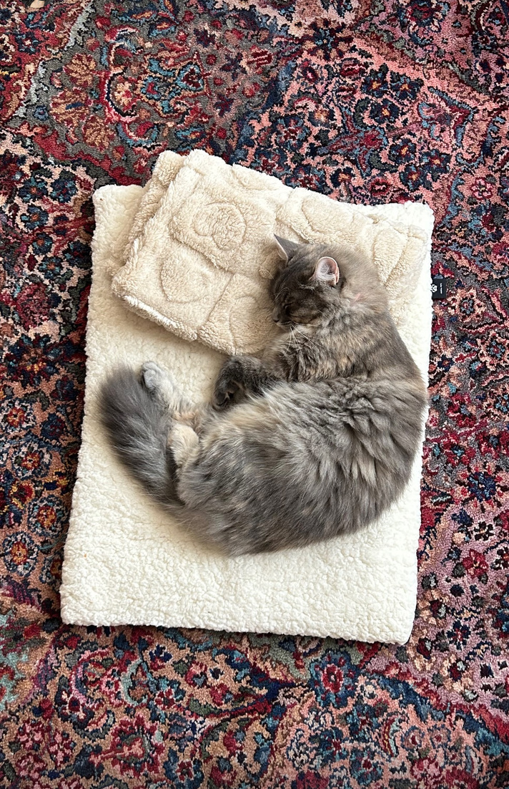

# Araitzia's Day

## Work Week
| Time| **Task** | 
|------|------|
| *5:00 am* | Wake up |
| *5:20 am* | Gym or go on walk |
| *6:30 am* | Come home, water plants |
| *6:45 am*  | Shower |
| *7:00 am* | Make breakfast, pack lunches | 
| *7:30 am* | Feed cat, finish getting ready for work |
| *8:15 am* | Leave for Work | 
| *8:30 am* | Work |
| *4:45 pm*| Come home, give cat a snack|  
| *5:00 pm* | `IF cooking = myturn` then cook, `ELIF != myturn` then homeowrk or free time | 
| *6:30 PM* | eat dinner |
| *7:30 PM* | `IF cooking = myturn` then home work or free time, `ELIF cooking != myturn`, then wash dishes and clean up kitchen| 
| *8:00pm* | play with cat, feed cat when done | 
| *8:20 pm* | wind down time, get ready for bed |
| *9:00 pm* | sleep | 

## Weekend

### 6:30 AM 
- wake up to cat yelling at me for "sleeping in" 
- feed cat
### 6:35 AM
- go back to sleep after cat is pleased 

